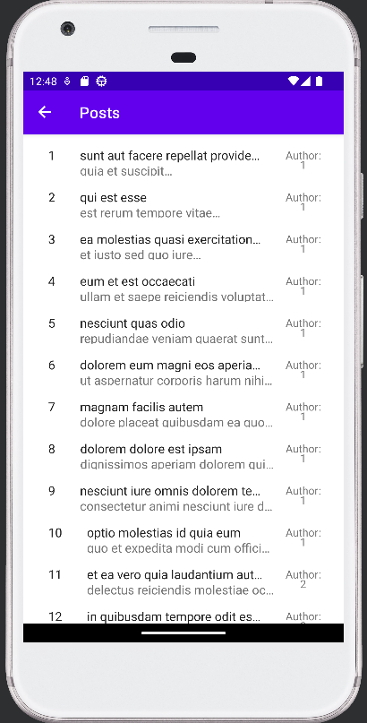
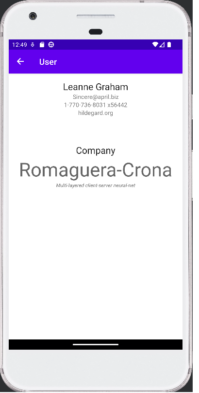

# JSON Placeholder App
Experimental project in Android Studio. Downloads data and shows them on sepasrate fragments.

Loading screen, etc, not included, only functionality

## Notes
- Post content is passed from Posts List to Individual Posts, this is intentional
- For Users, it's only the user id thats passed down, the fragment handles data downloading
- Both of these distinct choices are intentional
- HTTP Requests are cached if they implement ICacheable

## Images

